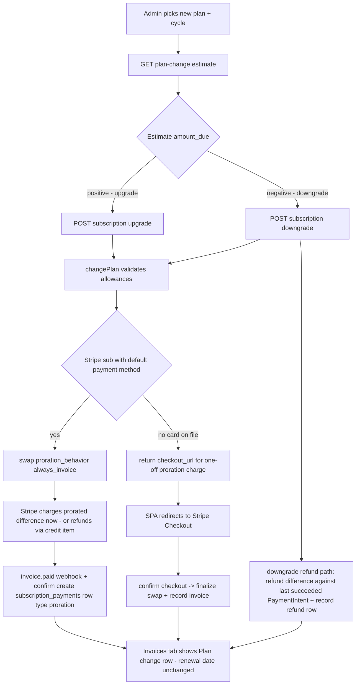

# Plan Switch (Upgrade / Downgrade) — Payment Gateway Redirect, Refunds & Invoice Records

## 1. Investigation Summary — Why the current switch does nothing payment-wise

Current flow for an ACTIVE subscription when the admin switches plan:

1. Frontend [`UpgradePlanDialog.tsx`](resources/js/features/billing/components/UpgradePlanDialog.tsx) fetches the estimate from `GET /subscription/plan-change`, then calls [`changePlan()`](resources/js/features/billing/hooks/useSubscription.ts:407) → `POST /subscription/upgrade` | `POST /subscription/downgrade`.
2. [`PlanSubscriptionController::upgrade()`](app/Http/Controllers/Api/PlanSubscriptionController.php:252) and [`PlanSubscriptionController::downgrade()`](app/Http/Controllers/Api/PlanSubscriptionController.php:281) both call [`SubscriptionService::changePlan()`](app/Services/SubscriptionService.php:405).
3. `changePlan()`:
   - validates seat/branch allowances,
   - calls [`StripeBillingProvider::swap()`](app/Billing/StripeBillingProvider.php:136) which updates the Stripe subscription price **without `proration_behavior`**,
   - updates the local `plan_id` / `billing_cycle` immediately,
   - **never redirects to a payment gateway**,
   - **never creates a `subscription_payments` (invoice) row**,
   - **never triggers a refund** on downgrade.

### Root causes (gap map)

| # | Gap | Where |
|---|-----|-------|
| G1 | `swap()` omits `proration_behavior` → Stripe default `create_prorations` defers the charge to the NEXT renewal invoice; nothing is charged now, no gateway redirect | [`StripeBillingProvider::swap()`](app/Billing/StripeBillingProvider.php:136) |
| G2 | Upgrade does not charge the rest of the money now, even though the local plan/entitlement flips immediately | [`SubscriptionService::changePlan()`](app/Services/SubscriptionService.php:415) |
| G3 | Downgrade never refunds the difference (Stripe only produces a credit balance, and even that is invisible locally) | same |
| G4 | No invoice record: the only writers of `subscription_payments` are [`BillingLifecycleService::upsertPayment()`](app/Services/BillingLifecycleService.php:150) (webhook `invoice.paid`) and [`SubscriptionService::recordPayment()`](app/Services/SubscriptionService.php:314) (initial subscribe). A proration invoice is never generated by the current swap, so nothing is ever recorded | — |
| G5 | Frontend has no branch for a `checkout_url` response from upgrade/downgrade (no redirect), only for the initial checkout | [`useSubscription.ts`](resources/js/features/billing/hooks/useSubscription.ts:584) |
| G6 | `subscription_payments` has no `type`/`description`/plan snapshot columns, so a plan-switch charge cannot be labeled in the Invoices tab | [`create_subscription_payments_table.php`](database/migrations/2026_07_27_000016_create_subscription_payments_table.php) |

## 2. Current architecture capability assessment

Already in place (good news — no rewrite needed):

- `BillingProvider` abstraction: [`BillingProvider`](app/Billing/BillingProvider.php) with `startCheckout`, `createSubscription`, `cancel`, `resume`, `swap`, `billingPortal`, `refund`.
- Stripe proration-safe webhook reconciliation: [`StripeBillingWebhookController::handleSubscriptionUpdated()`](app/Http/Controllers/Api/StripeBillingWebhookController.php:177) + [`reconcilePlanFromProvider()`](app/Http/Controllers/Api/StripeBillingWebhookController.php:266) converge local state with the provider price and revert illegal downgrades.
- Idempotent payment recording via `invoice.paid` → [`BillingLifecycleService::markPaid()`](app/Services/BillingLifecycleService.php:86) keyed on provider invoice id.
- Proration estimate endpoint: [`SubscriptionService::planChangeEstimate()`](app/Services/SubscriptionService.php:620) (preserves `ends_at`, computes "rest of the money").
- Refund plumbing: [`PaymentService::refund()`](app/Services/PaymentService.php:21) + [`StripeBillingProvider::refund()`](app/Billing/StripeBillingProvider.php:165) + super-admin route.
- Hosted Checkout + confirm endpoints for the no-card fallback.

Verdict: the architecture **can** handle the feature with targeted changes; the only missing pieces are (a) proration options in `swap()`, (b) immediate payment/refund orchestration in `changePlan()`, (c) invoice record tagging, (d) frontend redirect handling.

## 3. What we need from Stripe

Already configured: `STRIPE_KEY`, `STRIPE_SECRET`, `STRIPE_WEBHOOK_SECRET` (see `.env`), Laravel Cashier installed, hosted Checkout working.

| Requirement | Needed for | Notes |
|---|---|---|
| `proration_behavior: 'always_invoice'` on `subscriptions.update` | Upgrade: charge the prorated difference **immediately** with the default payment method; renews_at unchanged (`billing_cycle_anchor: 'unchanged'`) | Standard API — nothing to enable. Requires a saved default payment method |
| Default payment method on the Stripe customer/subscription | Immediate invoice payment | After hosted Checkout, verify `invoice_settings.default_payment_method` is set; if not, add `payment_method_collection` / `default_payment_method` handling |
| `expand: ['latest_invoice']` + invoice `billing_reason` | Tag the new invoice row as `proration` | Standard |
| `refunds.create` against the original PaymentIntent | Downgrade: cash-refund the prorated difference | Already implemented in `StripeBillingProvider::refund()` |
| `charge.refunded` webhook (optional) | Sync refunds made in the Stripe dashboard | New handler |
| No extra Stripe features/products | — | Prorations are on by default; no Billing-portal change needed |

Business decision required on downgrades: **cash refund** (what the user asked for) vs **credit balance** (Stripe default; applied to next renewal). The plan below implements cash refund with an explicit guard that the refund never exceeds what was actually paid for the current period.

## 4. Target flow

## 5. Implementation plan (ordered todos)

1. **Schema**: migration adding `type` (`subscription`|`proration`|`refund`, default `subscription`), nullable `description`, nullable `plan_id` snapshot FK, nullable `billing_reason` to `subscription_payments`; update [`SubscriptionPayment`](app/Models/SubscriptionPayment.php) fillable + [`SubscriptionPaymentResource`](app/Http/Resources/SubscriptionPaymentResource.php).
2. **Provider contract**: extend [`BillingProvider::swap()`](app/Billing/BillingProvider.php:63) with options `proration_behavior` + `proration_date`, and return the created Stripe invoice payload.
3. **Stripe implementation**: [`StripeBillingProvider::swap()`](app/Billing/StripeBillingProvider.php:136) — send `proration_behavior`, `proration_date => now`, `billing_cycle_anchor => 'unchanged'`, `expand => ['latest_invoice']`; return invoice id / amount_paid / payment_intent / billing_reason.
4. **Upgrade path**: [`SubscriptionService::changePlan()`](app/Services/SubscriptionService.php:405) — when target price > current price: perform swap with `always_invoice`; record a `subscription_payments` row (`type=proration`, amount from invoice, `provider_reference = invoice id` — idempotent with the webhook's `upsertPayment`); if Stripe reports `amount_due > 0` but unpaid (no default payment method), fall back to a hosted one-off Checkout for the difference and return `checkout_url` instead of applying the plan locally.
5. **Downgrade path**: in the same method, when target price < current price: swap with `create_prorations`, compute the credit from Stripe's proration invoice/credit note, refund that amount via [`PaymentService::refund()`](app/Services/PaymentService.php:21) against the current period's succeeded payment, and record a `type=refund` row (never refund more than the paid amount for the period; `ends_at` untouched).
6. **Webhook**: in [`StripeBillingWebhookController::handleInvoicePaid()`](app/Http/Controllers/Api/StripeBillingWebhookController.php:152) set `type = proration` when `billing_reason === 'subscription_update'` so the invoice tab labels plan-change charges; (optional) add `charge.refunded` handler to sync dashboard refunds.
7. **Frontend**: [`useSubscription.ts`](resources/js/features/billing/hooks/useSubscription.ts:584) — make `useUpgradeSubscription`/`useDowngradeSubscription` accept an optional `checkout_url` response and `window.location.assign` it; toast "paid X now" on success; keep [`UpgradePlanDialog.tsx`](resources/js/features/billing/components/UpgradePlanDialog.tsx) wording consistent with the actual behavior (charge now / refund now).
8. **API response**: `SubscriptionSummaryResource`/mutation payloads return `{ plan_changed: true, charge: {...} | null, refund: {...} | null, checkout_url?: string }`.
9. **Tests** (FakeProvider records swap options):
   - upgrade with default PM → swap called with `always_invoice`, proration invoice row exists, renewal date unchanged, Stripe called to charge;
   - upgrade without PM → response contains `checkout_url`, local plan NOT flipped until confirm;
   - downgrade → refund call with correct amount, refund row recorded, cannot exceed paid amount;
   - `invoice.paid` with `billing_reason=subscription_update` → row labeled `proration`, no duplicates;
   - existing allowance/reconcile tests keep passing.

## 6. Risks / notes

- Stripe cannot charge a card during `subscriptions.update` if no payment method exists — the Checkout fallback in step 4 covers this; the hosted Checkout flow already exists ([`startCheckout()`](app/Services/SubscriptionService.php:87)).
- Cash refunds on downgrades are a policy choice; the alternative (credit toward next renewal) is one config flag away since both paths share the proration invoice.
- The `invoice.paid` webhook already dedupes by invoice id, so the immediate swap-invoice and the webhook converge to a single row.
- Keep `ends_at` frozen: `billing_cycle_anchor: 'unchanged'` guarantees Stripe agrees with the local renewal-date preservation.
