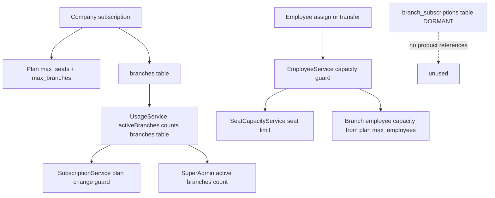

# Plan: Remove the Outdated Branch-Subscription Entitlement Guard

**Status:** Planning only — do **not** implement from this document. Hand off to Code mode.
**Author:** Architect mode
**Root cause confirmed by Debug mode:** subscriptions are company-scoped, but the employee-assignment path still asserts a **branch-scoped** entitlement row (`branch_subscriptions`) that newly created branches never receive.

---

## 1. Problem Statement (verified against source)

Changing an employee's branch fails with:

> `This branch is not active under the business subscription.` (`422`, code `BRANCH_NOT_ENTITLED`)

**Verified call chain:**

1. [`EmployeeService::update()`](app/Services/EmployeeService.php:127) detects a branch move and calls [`assertCapacityForAssignment()`](app/Services/EmployeeService.php:442).
2. [`EmployeeService::assertCapacityForAssignment()`](app/Services/EmployeeService.php:455) calls `BranchSubscriptionService::assertCanAddEmployee($company, $branch, 1)`.
3. [`BranchSubscriptionService::assertCanAddEmployee()`](app/Services/BranchSubscriptionService.php:207) throws at [line 230-237](app/Services/BranchSubscriptionService.php:230) when `! $this->entitlements->branchIsEntitled($branch)`.
4. [`EntitlementService::branchIsEntitled()`](app/Services/EntitlementService.php:203) requires a `branch_subscriptions` row with status in `trialing|active` ([entitled scope](app/Models/BranchSubscription.php:82)).

**Why it fails for real users:** [`BranchController::store()`](app/Http/Controllers/Api/BranchController.php:46) never creates a `branch_subscriptions` row, and neither [`BranchSeeder`](database/seeders/BranchSeeder.php:50) nor [`CompanySeeder`](database/seeders/CompanySeeder.php) seed one. The frontend `resources/js/features/branches/**` contains **zero** references to branch activation. Therefore every branch created through the product is permanently `entitled=no`, and any employee assigned to it is rejected.

The only reason *some* branches work is that they were seeded with `branch_subscriptions` rows by older data/tests.

**Conclusion:** the branch-scoped entitlement model is stale. The subscription belongs to the business (company); branches are an organisational dimension of that business, not separate billable units.

---

## 2. Recommended Scope

### Recommendation: **Option B+ — "Retire the enforcement, keep the shape dormant"**

Three options were considered:

| Option | Description | Verdict |
| --- | --- | --- |
| **A. Minimal** | Delete only the `branchIsEntitled()` check inside `assertCanAddEmployee()`. | ❌ Rejected. Leaves `activate/deactivate/capacity` endpoints, the `branchSubscriptions` relation, `activeBranches()` counting off a table nothing writes to, and ~8 test files asserting a dead model. The subsystem stays a trap for the next developer. |
| **B. Full teardown** | Drop the `branch_subscriptions` table, model, service, controller, routes, resources, factory, and all branch billing UI in one pass. | ⚠️ Correct end state, but high-risk in a single change: SuperAdmin [`active_branches_count`](app/Http/Controllers/Api/SuperAdminController.php:38) and the plan-downgrade guard [`assertCanSubscribeToPlan()`](app/Services/SubscriptionService.php:960) read branch data. Dropping the table before repointing those breaks the admin console and plan changes. |
| **B+. Staged teardown** ✅ | **Remove all branch *enforcement* and *branch-scoped entitlement* semantics now (Phases 1-3), repoint branch counting to the `branches` table (Phase 4), and leave the `branch_subscriptions` table + model physically in place, dormant and unreferenced by product code (Phase 5).** | ✅ **Recommended.** Fixes the reported bug immediately, eliminates the stale model from all decision paths, keeps admin/billing surfaces green, and makes the eventual table drop a trivial, isolated follow-up. |

### Rationale for B+

- **Immediate correctness:** employee branch moves succeed unconditionally (subject only to genuine company-level limits).
- **Non-destructive:** no data loss; the demo company's 3 existing rows remain readable if anything still looks at them.
- **Blast-radius contained:** the riskiest files (SuperAdmin counts, downgrade guard) are repointed to `branches`/`seats` **before** anything is dropped — and nothing is dropped in this task.
- **Reversibility:** every phase can ship independently and be verified on its own.

### Explicit scope envelope

**IN scope**

- Delete the `branchIsEntitled()` guard from the employee assignment path.
- Remove branch-scoped semantics from [`EntitlementService::allows()`](app/Services/EntitlementService.php:57) and `branchEmployeeCapacity()`.
- Simplify [`BranchSubscriptionService::assertCanAddEmployee()`](app/Services/BranchSubscriptionService.php:207) to company-subscription + capacity only; delete `activateBranch`/`deactivateBranch`/`setEmployeeCapacity` and `BranchSubscriptionController`.
- Delete the branch activate/deactivate/capacity routes.
- Move `transferEmployee()` out of `BranchSubscriptionService` into [`EmployeeService`](app/Services/EmployeeService.php:16) (it is employee logic, not billing).
- Repoint [`UsageService::activeBranches()`](app/Services/UsageService.php:66) to count real branches from the `branches` table.
- Repoint [`SubscriptionService::assertCanSubscribeToPlan()`](app/Services/SubscriptionService.php:960) branch check to the new counter.
- Repoint SuperAdmin `active_branches_count` to the `branches` table.
- Strip branch-entitlement/capacity fields from [`PlanSubscriptionController::usage()`](app/Http/Controllers/Api/PlanSubscriptionController.php:145) and [`SubscriptionSummaryResource`](app/Http/Resources/SubscriptionSummaryResource.php:112).
- Remove the `branchSubscriptions`/`activeBranchSubscription` relations from [`Branch`](app/Models/Branch.php:199), [`Company`](app/Models/Company.php:217), [`Subscription`](app/Models/Subscription.php:146).
- Remove `Feature::isBranchScoped()` semantics (the enum stays, the method is dropped or hard-returns `false`).
- Remove `EnsureFeatureAccess` branch-parameter handling.
- Delete or repoint all branch-subscription tests.
- Remove frontend branch-billing hooks/components.

**OUT of scope (this task)**

- Dropping the `branch_subscriptions` table or its migration — **kept dormant**.
- Deleting [`BranchSubscription`](app/Models/BranchSubscription.php:11) model, [`BranchSubscriptionFactory`](database/factories/BranchSubscriptionFactory.php), or `BranchQueueException` — **kept dormant** (no product references after Phase 3).
- Changing `plans.max_branches` column/semantics — **retained** and now enforced against real branch counts.
- Any Stripe/billing-provider price or quantity logic (branches were never billable).
- Redesigning the branch creation UX.

---

## 3. Target Architecture (after Phase 4)



**Key semantic change:** `activeBranches(company)` is redefined from *"branches with an entitled branch_subscription"* to *"branches with `status = active` in the `branches` table."* This preserves `max_branches` plan enforcement (a real product feature) while removing the stale entitlement dependency.

---

## 4. Ordered Change List (file by file)

> Execute phases in order. Run the verification gate at the end of each phase before proceeding.

### Phase 1 — Unblock the employee assignment path (fixes the reported bug)

**1.1 [`app/Services/EntitlementService.php`](app/Services/EntitlementService.php)**

- **Delete** `branchIsEntitled()` ([lines 199-211](app/Services/EntitlementService.php:203)).
- **Rewrite** [`allows()`](app/Services/EntitlementService.php:57) — drop the branch-scoped branch at [lines 69-71](app/Services/EntitlementService.php:69); keep the `enabledFeatureKeys` check. New body returns `true` after the feature-enabled check. Keep the `?Branch $branch = null` parameter for signature compatibility (callers pass it) but document it as accepted-and-ignored, **or** remove the parameter and update the two call sites ([`EnsureFeatureAccess`](app/Http/Middleware/EnsureFeatureAccess.php:64), plus any test). Preferred: **keep the parameter, ignore it** to minimize churn in this phase; clean up in Phase 3.
- **Rewrite** `branchEmployeeCapacity()` ([lines 213-235](app/Services/EntitlementService.php:219)) — remove the `branchSubscriptions()` lookup; resolve capacity purely from the company's entitled plan `max_employees`. New logic: `$subscription = $this->entitledSubscription($branch->company); return $subscription?->plan?->max_employees;` (guard `$branch->company` being null → return `null`).
- **Remove** the now-unused `use App\Models\Branch;` only if no other method needs it (yes — `allows()` may still type-hint `Branch`; keep the import if the parameter is retained).

**1.2 [`app/Services/BranchSubscriptionService.php`](app/Services/BranchSubscriptionService.php)**

- **Rewrite** [`assertCanAddEmployee()`](app/Services/BranchSubscriptionService.php:207):
  - Keep: `assertBranchBelongsToCompany()`, the `lockForUpdate()` on the branch row, the `hasEntitledSubscription()` → `NO_ACTIVE_SUBSCRIPTION` throw, and the capacity arithmetic.
  - **Delete** the `branchIsEntitled()` block at [lines 230-237](app/Services/BranchSubscriptionService.php:230) (the reported error).
  - Update the method docblock ([lines 192-206](app/Services/BranchSubscriptionService.php:192)) to remove the "branch is entitled" bullet and mention that `usage->branchEmployeeCapacity()` now resolves from the plan.
- **Delete** `activateBranch()` ([lines 40-136](app/Services/BranchSubscriptionService.php:54)).
- **Delete** `deactivateBranch()` ([lines 138-190](app/Services/BranchSubscriptionService.php:146)).
- **Delete** `setEmployeeCapacity()` ([lines 312-379](app/Services/BranchSubscriptionService.php:319)).
- **Move** `transferEmployee()` → new `EmployeeService::transferEmployee()` ([see 1.3](app/Services/BranchSubscriptionService.php:275)). Its body is unchanged except it calls `$this->assertCapacityForAssignment($employee->company_id, $destination->id)` instead of `$this->assertCanAddEmployee(...)`, and it no longer needs `assertBranchBelongsToCompany` as a protected sibling (inline the company-id comparison — return/abort on mismatch).
- **Keep** `assertBranchBelongsToCompany()` (still used by `assertCanAddEmployee`).
- **Remove now-unused imports:** `SubscriptionStatus`, `BranchSubscription`, `Company`/`User` may still be needed by `assertCanAddEmployee` — trim precisely.
- **Add a class docblock note** that this class is retained in transitional form for employee capacity only.

**1.3 [`app/Services/EmployeeService.php`](app/Services/EmployeeService.php)**

- Add `transferEmployee(Employee $employee, Branch $destination, ?User $actor = null): Employee`, moved verbatim from [`BranchSubscriptionService::transferEmployee()`](app/Services/BranchSubscriptionService.php:275), including the `DB::transaction` wrapper, the no-op same-branch early return, the pre-mutation capacity validation, the `activity('employee')` audit event, and the `->load(['company','branch'])` return.
- Inject `BranchSubscriptionService` is **still required** in the constructor ([line 18-21](app/Services/EmployeeService.php:18)) because `assertCapacityForAssignment()` still delegates to it. **Keep the dependency** in this phase; Phase 3 revisits.
- Update the [`assertCapacityForAssignment()`](app/Services/EmployeeService.php:442) docblock ([lines 429-441](app/Services/EmployeeService.php:429)) — remove the "not entitled" wording from the `@throws` note.

**1.4 [`app/Http/Controllers/Api/EmployeeController.php`](app/Http/Controllers/Api/EmployeeController.php)**

- [`transfer()`](app/Http/Controllers/Api/EmployeeController.php:217): change the call at [lines 223-227](app/Http/Controllers/Api/EmployeeController.php:223) from `$this->branchSubscriptions->transferEmployee(...)` to `$this->employeeService->transferEmployee(...)`.
- **Remove** the `BranchSubscriptionService` constructor dependency ([lines 26-29](app/Http/Controllers/Api/EmployeeController.php:26)) and its import ([line 16](app/Http/Controllers/Api/EmployeeController.php:16)).
- Keep `use App\Models\Branch;` — still needed for `Branch::findOrFail()` at [line 221](app/Http/Controllers/Api/EmployeeController.php:221).

### Phase 2 — Remove the branch subscription HTTP surface

**2.1 [`app/Http/Controllers/Api/BranchSubscriptionController.php`](app/Http/Controllers/Api/BranchSubscriptionController.php)**

- **Delete** `activate()`, `deactivate()`, `updateCapacity()`.
- **Keep and move** `usage()`: relocate the surviving `usage()` + `resolveCompany()` into [`PlanSubscriptionController::usage()`](app/Http/Controllers/Api/PlanSubscriptionController.php:145) (which already returns an equivalent payload) and then **delete the whole controller**.
- Consequence: `GET /api/v1/usage` must be repointed (see 2.2) to the `PlanSubscriptionController` equivalent, or kept as a thin alias.

**2.2 [`routes/api.php`](routes/api.php:264)**

- **Delete** the three branch lifecycle routes ([lines 264-272](routes/api.php:267)):
  - `POST branches/{branch}/activate`
  - `POST branches/{branch}/deactivate`
  - `PUT branches/{branch}/capacity`
- **Repoint** `GET usage` ([line 273](routes/api.php:273)) to `[PlanSubscriptionController::class, 'usage']`, keeping the name `api.usage`, **or** drop it if no client calls it (verify with the frontend grep in §7 — `useBranchBilling` is the only caller and it is removed in Phase 5).
- Remove the now-unused `BranchSubscriptionController` import.

**2.3 HTTP request classes**

- **Delete** [`ActivateBranchRequest`](app/Http/Requests/Branch/ActivateBranchRequest.php) and [`UpdateBranchCapacityRequest`](app/Http/Requests/Branch/UpdateBranchCapacityRequest.php) (verify the exact filenames under `app/Http/Requests/Branch/`; the controller imports them at [lines 6-7](app/Http/Controllers/Api/BranchSubscriptionController.php:6)).

**2.4 [`app/Policies/BranchPolicy.php`](app/Policies/BranchPolicy.php:62)**

- **Delete** `activate()`, `deactivate()`, `manageCapacity()` ([lines 62-86](app/Policies/BranchPolicy.php:62)). They are only used by the deleted controller actions.

### Phase 3 — Clean the entitlement + usage data model

**3.1 [`app/Services/UsageService.php`](app/Services/UsageService.php)**

- **Rewrite** [`activeBranches()`](app/Services/UsageService.php:66) to count real branches:
  ```php
  return $company->branches()->where('status', 'active')->count();
  ```
  Update the docblock ([lines 58-65](app/Services/UsageService.php:58)) to describe the new company-scoped meaning (no entitlement dependency).
- **Rewrite** [`branchUsageDetails()`](app/Services/UsageService.php:234) — remove the `whereHas('branchSubscriptions')` filter ([lines 237-241](app/Services/UsageService.php:237)); iterate all active branches instead. Keep the per-branch `employees_used` / `capacity` / `remaining` shape (it is a genuine reporting feature).
- [`branchEmployeeCapacity()`](app/Services/UsageService.php:199) — no code change needed (it delegates to `EntitlementService`, already simplified in 1.1), but update the comment that mentions "branch subscription override".
- [`remainingEmployeeCapacity()`](app/Services/UsageService.php:208) and [`canAddEmployee()`](app/Services/UsageService.php:222) — unchanged; they inherit the new plan-based capacity.
- Update the class docblock ([lines 11-33](app/Services/UsageService.php:11)) — remove "legacy branch-count … until the branch subsystem is removed" wording where it now describes live behaviour.

**3.2 [`app/Services/SubscriptionService.php`](app/Services/SubscriptionService.php:960)**

- **Keep** the branch allowance check at [lines 962-973](app/Services/SubscriptionService.php:962) — it now reads the repointed `activeBranches()`, so `DOWNGRADE_BRANCH_LIMIT_EXCEEDED` continues to work against real branch counts.
- Update the docblocks at [lines 922-930](app/Services/SubscriptionService.php:922) and [942-959](app/Services/SubscriptionService.php:942) to drop "retained until the branch subsystem is removed" and describe the branch allowance as a live plan limit.
- **No behavioural change** — this is a comment/UX accuracy pass.

**3.3 [`app/Http/Controllers/Api/SuperAdminController.php`](app/Http/Controllers/Api/SuperAdminController.php:38)**

- Replace the `withCount` on `branchSubscriptions as active_branches_count` ([lines 38-42](app/Http/Controllers/Api/SuperAdminController.php:38)) with a company-scoped real branch count. Because the query is on `Subscription` with `company`, use a nested `withCount` through the company relation, e.g.:
  ```php
  ->withCount(['company as active_branches_count' => fn ($q) => $q->where('status', 'active')])
  ```
  **or** compute per row via `$this->usage->activeBranches($company)` inside the `paginatedEnvelope` mapper ([line 62](app/Http/Controllers/Api/SuperAdminController.php:62)) where `$company` is already resolved. **Preferred: the mapper approach** — it reuses the single authoritative counter and avoids eager-load subtleties.
- Keep the output key `active_branches_count` so [`useSuperAdmin.ts`](resources/js/features/super-admin/hooks/useSuperAdmin.ts:249) needs no change.

**3.4 [`app/Http/Controllers/Api/PlanSubscriptionController.php`](app/Http/Controllers/Api/PlanSubscriptionController.php:145)**

- In `usage()`:
  - **Delete** the `'active' => $this->entitlements->branchIsEntitled($branch)` key ([line 159](app/Http/Controllers/Api/PlanSubscriptionController.php:159)).
  - **Change** `'employee_capacity'` ([line 161](app/Http/Controllers/Api/PlanSubscriptionController.php:161)) to read from the plan-based capacity (it already delegates to `EntitlementService::branchEmployeeCapacity`, which is now plan-based — so this line may need **no change**, only verification).
  - Keep `'remaining'` ([line 162](app/Http/Controllers/Api/PlanSubscriptionController.php:162)).
  - `'branches' => ['used' => $this->usage->activeBranches($company), ...]` ([lines 168-171](app/Http/Controllers/Api/PlanSubscriptionController.php:168)) — **keep**; `activeBranches` is now table-based.
- In `plans()` and `features()` — **keep** `max_branches`, `'branch_scoped' => $feature->isBranchScoped()` **only if** §3.6 retains the method; otherwise replace with `false` or drop the key (coordinate with the frontend type in §7).

**3.5 [`app/Http/Resources/SubscriptionSummaryResource.php`](app/Http/Resources/SubscriptionSummaryResource.php:112)**

- The `usage` fallback ([lines 112-115](app/Http/Resources/SubscriptionSummaryResource.php:112)) and the `'branch_scoped'` key ([line 60](app/Http/Resources/SubscriptionSummaryResource.php:60)) — verify they still resolve after §3.6. Keep `max_branches` ([line 76](app/Http/Resources/SubscriptionSummaryResource.php:76)).

**3.6 [`app/Enums/Feature.php`](app/Enums/Feature.php:59)**

- **Rewrite** `isBranchScoped()` to always return `false`, **or** delete it and update the four call sites:
  - [`EnsureFeatureAccess`](app/Http/Middleware/EnsureFeatureAccess.php:60)
  - [`PlanSubscriptionController::features()`](app/Http/Controllers/Api/PlanSubscriptionController.php:193)
  - [`SubscriptionSummaryResource`](app/Http/Resources/SubscriptionSummaryResource.php:60)
  - [`FeatureController`](app/Http/Controllers/Api/FeatureController.php:47)
- **Recommended:** keep the method but return `false` and add a `@deprecated` note. This keeps the `branch_scoped` API key present (frontend types stay valid) while removing all branch-scoped gating. Fewer files touched, trivially reversible.

**3.7 [`app/Http/Middleware/EnsureFeatureAccess.php`](app/Http/Middleware/EnsureFeatureAccess.php:60)**

- Remove the branch resolution block ([lines 58-62](app/Http/Middleware/EnsureFeatureAccess.php:58)) and pass `null` (or drop the third argument) to `allows()`.
- Update the class docblock example at [line 16](app/Http/Middleware/EnsureFeatureAccess.php:16) that advertises `feature:shift_swap,123` branch-awareness.

**3.8 Model relations**

- [`app/Models/Branch.php`](app/Models/Branch.php:199) — **delete** `branchSubscriptions()` and `activeBranchSubscription()` ([lines 193-216](app/Models/Branch.php:193)). Remove the `BranchSubscription` import if unused.
- [`app/Models/Company.php`](app/Models/Company.php:217) — **delete** `branchSubscriptions()`.
- [`app/Models/Subscription.php`](app/Models/Subscription.php:146) — **delete** `branchSubscriptions()`.

> ⚠️ **Ordering constraint:** delete these relations **only after** all `whereHas('branchSubscriptions')` usages are gone (§3.1) and all `->branchSubscriptions()`/`activeBranchSubscription()` call sites are gone (§3.4, §3.6, and the deleted service methods). Grep before deleting — see §6 Gate 3.

**3.9 [`app/Exceptions/BranchCapacityException.php`](app/Exceptions/BranchCapacityException.php:23) and [`bootstrap/app.php`](bootstrap/app.php:62)**

- **Keep both.** `assertCanAddEmployee()` still throws `NO_ACTIVE_SUBSCRIPTION` and `EMPLOYEE_CAPACITY_REACHED`, and `assertBranchBelongsToCompany()` still throws `CROSS_BUSINESS_ACCESS_DENIED`. The renderer at [bootstrap/app.php:62](bootstrap/app.php:62) stays.
- Update the exception's class docblock ([lines 7-22](app/Exceptions/BranchCapacityException.php:7)) to drop branch-entitlement wording; the `EMPLOYEE_CAPACITY_REACHED` example stays accurate.

### Phase 4 — Data handling (non-destructive, as recommended)

**4.1 No migration in this task.**

- Do **not** drop `branch_subscriptions`.
- Do **not** delete existing rows.
- Rationale: existing rows are harmless once unreferenced; a destructive migration adds rollback risk with zero product benefit at this stage.

**4.2 Add a future-facing comment (optional but recommended).**

- Add a `// DEPRECATED: branch subscriptions are no longer part of the entitlement model. Table retained dormant; see plans/remove-branch-subscription-guard.md.` note at the top of [`2026_08_28_000003_create_branch_subscriptions_table.php`](database/migrations/2026_08_28_000003_create_branch_subscriptions_table.php:23) and in the [`BranchSubscription`](app/Models/BranchSubscription.php:11) class docblock. This prevents a future reader from assuming the table is live.

**4.3 Unused branches (e.g. demo `ghjk`, branch id 4).**

- **No data action.** After Phase 1, that branch immediately accepts employees — which *is* the fix. There is no backfill needed because no code path consults `branch_subscriptions` for entitlement any more.

**4.4 Seeder follow-up (optional, low priority).**

- [`BranchSeeder`](database/seeders/BranchSeeder.php:50) and [`CompanySeeder`](database/seeders/CompanySeeder.php) do not create branch subscriptions — this was the original gap. **No change required** after this plan (the model is gone), but do **not** "fix" them by adding branch subscription creation.

---

## 5. Test Reconciliation

### 5.1 Delete outright (branch-subscription subsystem tests)

| File | Reason |
| --- | --- |
| [`tests/Feature/Billing/BranchSubscriptionTest.php`](tests/Feature/Billing/BranchSubscriptionTest.php:15) | Entirely about the model, its scopes, and its relations. |
| [`tests/Feature/Billing/BranchUsageRulesTest.php`](tests/Feature/Billing/BranchUsageRulesTest.php:20) | Entirely about `activate`/`deactivate`/capacity-override lifecycle and branch allowance counting via branch subscriptions. |
| [`tests/Feature/Billing/BranchCapacityTest.php`](tests/Feature/Billing/BranchCapacityTest.php:1) | Covers the activate/deactivate/capacity endpoints and the `BRANCH_NOT_ENTITLED` guard. **Exception:** salvage the pure capacity-overflow and "employee without branch is not capacity-checked" cases into a company-scoped test file (see 5.3). |

### 5.2 Rewrite to the company-scoped model

| File | Required change |
| --- | --- |
| [`tests/Unit/Services/EntitlementServiceTest.php`](tests/Unit/Services/EntitlementServiceTest.php:82) | Remove all `BranchSubscription::factory()` setup ([lines 90, 241, 260, 290](tests/Unit/Services/EntitlementServiceTest.php:90)). Replace branch-scoped feature tests with company-plan-only assertions. Rewrite `test_branch_employee_capacity_falls_back_to_plan` ([line 282](tests/Unit/Services/EntitlementServiceTest.php:282)) → assert capacity always comes from the plan (no branch override). **Flip:** `assertTrue($this->entitlements->branchIsEntitled($branch))` ([line 249](tests/Unit/Services/EntitlementServiceTest.php:249)) — delete, method is gone. |
| [`tests/Feature/Billing/FeatureEntitlementTest.php`](tests/Feature/Billing/FeatureEntitlementTest.php:192) | The branch-entitlement block ([lines 192-203](tests/Feature/Billing/FeatureEntitlementTest.php:192)) asserts a branch without a subscription is not entitled. **Flip:** assert features are available to the company regardless of any branch row. Remove `BranchSubscription` import. |
| [`tests/Feature/Billing/TrialLifecycleTest.php`](tests/Feature/Billing/TrialLifecycleTest.php:66) | Delete the `activate` endpoint tests ([lines 79-81, 603-605](tests/Feature/Billing/TrialLifecycleTest.php:79)). Rewrite `test_branch_lifecycle_create_activate_employees_capacity_deactivate_reactivate` ([line 695](tests/Feature/Billing/TrialLifecycleTest.php:695)) → a "create branch, add employees up to plan capacity, transfer between branches" test with no activation step. Rewrite the capacity tests ([lines 450-548](tests/Feature/Billing/TrialLifecycleTest.php:450)) to drive capacity off `max_employees` instead of `$branch->activeBranchSubscription()->update([...])`. |
| [`tests/Feature/Billing/SubscriptionPlanTest.php`](tests/Feature/Billing/SubscriptionPlanTest.php:1) | Remove branch lifecycle tests ([lines 699-759](tests/Feature/Billing/SubscriptionPlanTest.php:699)). Rewrite `test_subscription_usage_reports_branch_and_capacity` ([line 308](tests/Feature/Billing/SubscriptionPlanTest.php:308)) → keep `employees_used`/`employee_capacity`/`remaining`, drop the `active` key. Keep all `max_branches` assertions ([lines 185, 283, 297](tests/Feature/Billing/SubscriptionPlanTest.php:185)) — `max_branches` remains live. |
| [`tests/Feature/Billing/SubscriptionSelfServiceSurfaceTest.php`](tests/Feature/Billing/SubscriptionSelfServiceSurfaceTest.php:171) | Delete the `activate` test ([lines 171-173](tests/Feature/Billing/SubscriptionSelfServiceSurfaceTest.php:171)). Seat-capacity downgrade tests ([lines 489-604](tests/Feature/Billing/SubscriptionSelfServiceSurfaceTest.php:489)) mostly stay; verify they no longer rely on branch activation. |
| [`tests/Feature/Billing/StripeCheckoutFlowTest.php`](tests/Feature/Billing/StripeCheckoutFlowTest.php:170) | Delete the `activate` test ([lines 170-172](tests/Feature/Billing/StripeCheckoutFlowTest.php:170)). Seat-capacity checkout tests remain valid. |
| [`tests/Feature/Security/RoleAccessControlTest.php`](tests/Feature/Security/RoleAccessControlTest.php:181) | Delete `test_scheduler_cannot_activate_branch` ([line 181](tests/Feature/Security/RoleAccessControlTest.php:181)), `test_scheduler_cannot_deactivate_branch` ([line ~512](tests/Feature/Security/RoleAccessControlTest.php:512)), `test_scheduler_cannot_change_branch_capacity` ([line 520](tests/Feature/Security/RoleAccessControlTest.php:520)) — endpoints gone. Keep `test_capacity_blocked_employee_creation_shows_the_company_admin_message` ([line 529](tests/Feature/Security/RoleAccessControlTest.php:529)) — **verify** it now reaches `EMPLOYEE_CAPACITY_REACHED` via plan capacity rather than a branch subscription row. |
| [`tests/Feature/Billing/SeatCapacityTest.php`](tests/Feature/Billing/SeatCapacityTest.php:1) | Likely **no change** — it is about seats, but grep for any `BranchSubscription` factory usage and remove it. |
| [`tests/Feature/SuperAdmin/SuperAdminPlatformTest.php`](tests/Feature/SuperAdmin/SuperAdminPlatformTest.php:~101) | Verify `active_branches_count` assertions still pass with the repointed counter (value should be unchanged for seeded data, but the source differs). Update fixtures if the test creates branch subscription rows directly. |
| [`tests/Feature/Billing/BillingProviderWebhookTest.php`](tests/Feature/Billing/BillingProviderWebhookTest.php:727) | No branch-subscription usage found; **verify only** (it sets `max_branches` but does not exercise branch rows). |

### 5.3 New/replacement test coverage (add)

Create `tests/Feature/Billing/EmployeeBranchAssignmentTest.php` covering:

1. **Regression (the reported bug):** a company on an active plan creates a branch via the API (no activation step) and moves an active employee onto it → `200`, employee `branch_id` updated.
2. **Cross-company guard retained:** moving an employee to another company's branch → `403 CROSS_BUSINESS_ACCESS_DENIED`.
3. **Company subscription guard retained:** moving an employee when the company has no entitled subscription → `422 NO_ACTIVE_SUBSCRIPTION`.
4. **Plan capacity retained:** with plan `max_employees = 2` and 2 active employees in the destination, the move → `422 EMPLOYEE_CAPACITY_REACHED` with `used`/`capacity`/`remaining`.
5. **Employee without a branch** is never capacity-checked (salvaged from [`BranchCapacityTest`](tests/Feature/Billing/BranchCapacityTest.php:375)).
6. **Branch allowance still enforced:** company on `max_branches = 1` with an existing active branch cannot add a second active branch via downgrade guard / creation path → `DOWNGRADE_BRANCH_LIMIT_EXCEEDED` where applicable.

### 5.4 Assertions that must FLIP

- `assertJsonPath('code', 'BRANCH_NOT_ENTITLED')` → **remove entirely** (the error no longer exists).
- `$this->entitlements->branchIsEntitled($branch)` → **remove** (method deleted).
- `assertNull($branch->fresh()->activeBranchSubscription())` → **remove** (relation deleted).
- Branch-scoped feature `allows($company, $feature, $branch)` being `false` without a branch row → **flips to `true`** (company-scoped).
- `BranchSubscription::where(...)->count()` assertions → **remove**.

---

## 6. Verification Steps & Definition of Done

### Gate 1 (after Phase 1) — the bug is fixed

```bash
php artisan test --filter=EmployeeServiceTest
php artisan test --filter=EmployeeBranchAssignmentTest
php artisan test --filter=SeatCapacityTest
```

Manual smoke check: create a branch in the UI, open an employee, change their branch, save → succeeds with no `BRANCH_NOT_ENTITLED`.

### Gate 2 (after Phase 2) — routes/controllers are gone

```bash
php artisan route:list --path=branches
php artisan route:list --path=usage
php artisan test --filter=BranchSubscriptionTest
```

Expected: no `activate`/`deactivate`/`capacity` routes listed; the deleted test files no longer exist / are removed from the suite.

### Gate 3 (after Phase 3) — no dangling references

```bash
php artisan test --filter=Billing
php artisan test --filter=SuperAdmin
```

Reference audit (must return **zero** product hits):

```
rg "branchIsEntitled|branchSubscriptions\(|activeBranchSubscription|BranchSubscriptionService|activateBranch|deactivateBranch|setEmployeeCapacity|assertCanAddEmployee" app routes resources/js
```

Expected remaining hits: only the dormant [`BranchSubscription`](app/Models/BranchSubscription.php:11) model, its factory, the migration, and this plan's docblock notes.

### Gate 4 (full suite + frontend types)

```bash
php artisan test
npx tsc --noEmit -p tsconfig.check.json
npm run build
```

### Definition of Done

- [ ] Changing an employee's branch succeeds for any branch of the company that has an active subscription and available seat/branch capacity.
- [ ] `BRANCH_NOT_ENTITLED` and the branch-entitlement guard no longer exist anywhere in `app/`.
- [ ] `BranchSubscriptionController`, its routes, requests, and policy methods are deleted.
- [ ] `entitlements.branchIsEntitled()` and `BranchSubscriptionService::{activateBranch, deactivateBranch, setEmployeeCapacity}` are deleted.
- [ ] `transferEmployee()` lives in `EmployeeService`; `EmployeeController` no longer depends on `BranchSubscriptionService`.
- [ ] `UsageService::activeBranches()` counts `branches.status = active`; `max_branches` allowance/downgrade enforcement still works.
- [ ] SuperAdmin `active_branches_count` still populated (now from the branches table).
- [ ] Full PHP test suite green; `tsc` and the frontend build green.
- [ ] `branch_subscriptions` table and `BranchSubscription` model remain in the repo, dormant, with a deprecation note.

---

## 7. Frontend Impact

| Path | Finding | Action |
| --- | --- | --- |
| [`resources/js/features/billing/hooks/useBranchBilling.ts`](resources/js/features/billing/hooks/useBranchBilling.ts:106) | Implements `useActivateBranch`, `useDeactivateBranch`, `useUpdateBranchCapacity` against the deleted endpoints. | **Delete the file.** |
| [`resources/js/features/billing/components/BranchUsageCard.tsx`](resources/js/features/billing/components/BranchUsageCard.tsx:31) | Renders per-branch capacity with an "Increase capacity" action wired to the deleted mutation. | **Delete** (verify no page imports it — grep in §7 note below). |
| [`resources/js/features/billing/components/BranchCapacityDialog.tsx`](resources/js/features/billing/components/BranchCapacityDialog.tsx:18) | Dialog for the deleted capacity mutation. | **Delete.** |
| [`resources/js/features/billing/lib/permissions.ts`](resources/js/features/billing/lib/permissions.ts:38) | `canManageBranchBilling()` used only by the deleted components. | **Delete the function** (verify via grep). |
| [`resources/js/features/billing/types.ts`](resources/js/features/billing/types.ts:97) | `BranchUsageSummary`, `BranchUsageItem`, and the `branches`/`branchUsage` keys of `SubscriptionUsage`. | **Keep the types** (the `usage` payload still returns `branches` + `branch_usage` for reporting), but **drop** the `BranchUsageItem.active` field if it existed. Since §3.6 keeps `branch_scoped` returning `false`, no type breakage. |
| [`resources/js/features/billing/hooks/useSubscription.ts`](resources/js/features/billing/hooks/useSubscription.ts:200) | `mapBranchUsage` maps `id`/`employees_used`/`employee_capacity`/`remaining`. | **Keep** — payload keys unchanged; only the removed `active` key matters (it was never mapped here). |
| [`resources/js/features/super-admin/hooks/useSuperAdmin.ts`](resources/js/features/super-admin/hooks/useSuperAdmin.ts:249) | `activeBranchesCount: dto.active_branches_count ?? 0`. | **No change** — backend key preserved. |
| [`resources/js/types/super-admin.ts`](resources/js/types/super-admin.ts:140) | `active_branches_count: number`. | **No change.** |
| [`resources/js/features/branches/**`](resources/js/features/branches) | Confirmed **zero** references to activate/`BranchSubscription`. | **No change.** |
| [`resources/js/lib/capacity-errors.ts`](resources/js/lib/capacity-errors.ts:6) | Maps structured `422` capacity errors. | **Verify** it does not special-case `BRANCH_NOT_ENTITLED`; if it does, remove that branch. |

**Bundled billing page** ([`SubscriptionDashboardPage.tsx`](resources/js/features/billing/pages/SubscriptionDashboardPage.tsx:1)) — confirm it does not render `BranchUsageCard` before deleting the component. If it does, remove the card usage and keep the surrounding seats UI.

---

## 8. Implementation Order Summary (for the Code-mode task)

1. **Phase 1** — [`EntitlementService`](app/Services/EntitlementService.php), [`BranchSubscriptionService`](app/Services/BranchSubscriptionService.php), [`EmployeeService`](app/Services/EmployeeService.php), [`EmployeeController`](app/Http/Controllers/Api/EmployeeController.php) → run Gate 1.
2. **Phase 2** — delete [`BranchSubscriptionController`](app/Http/Controllers/Api/BranchSubscriptionController.php), requests, routes, policy methods → run Gate 2.
3. **Phase 3** — [`UsageService`](app/Services/UsageService.php), [`SubscriptionService`](app/Services/SubscriptionService.php) comments, [`SuperAdminController`](app/Http/Controllers/Api/SuperAdminController.php), [`PlanSubscriptionController`](app/Http/Controllers/Api/PlanSubscriptionController.php), [`Feature`](app/Enums/Feature.php), [`EnsureFeatureAccess`](app/Http/Middleware/EnsureFeatureAccess.php), model relations → run Gate 3.
4. **Phase 4** — deprecation notes only; no migration.
5. **Phase 5** — test reconciliation (§5) + frontend deletions (§7) → run Gate 4.

Do **not** drop the `branch_subscriptions` table, delete the [`BranchSubscription`](app/Models/BranchSubscription.php:11) model, or remove `plans.max_branches` — those are deliberate OUT-of-scope decisions recorded in §2.
